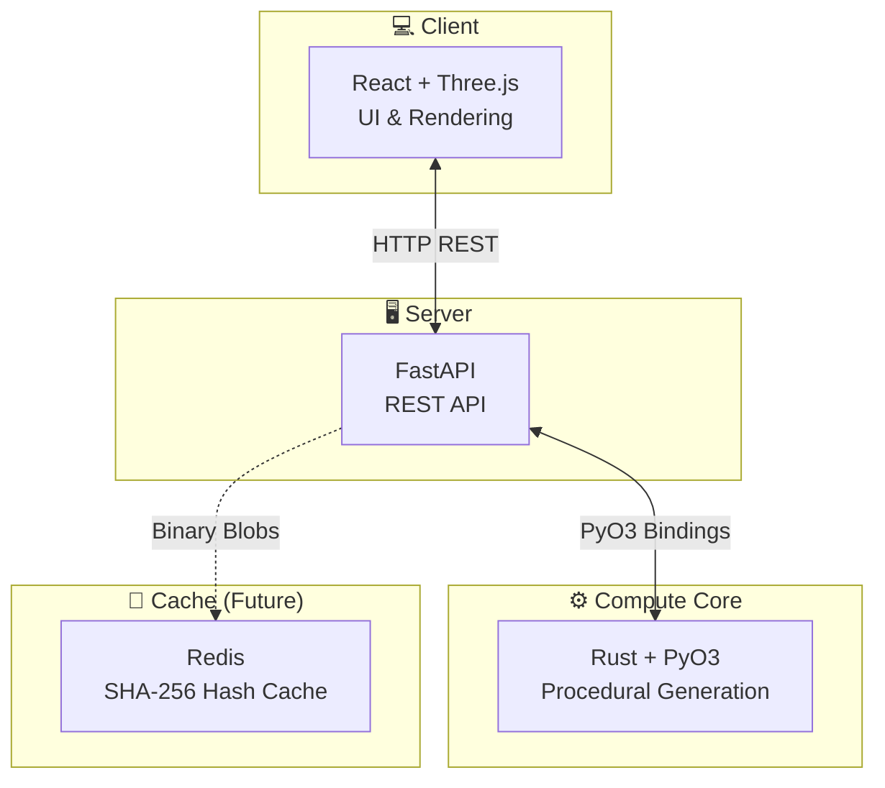
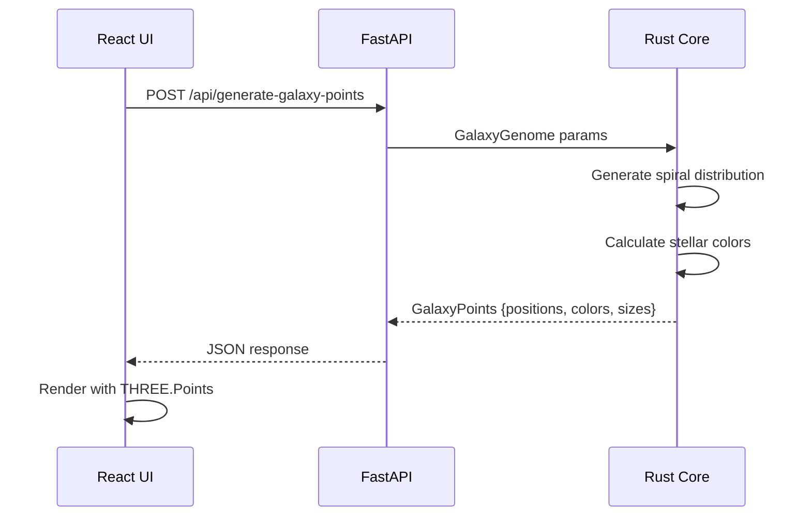
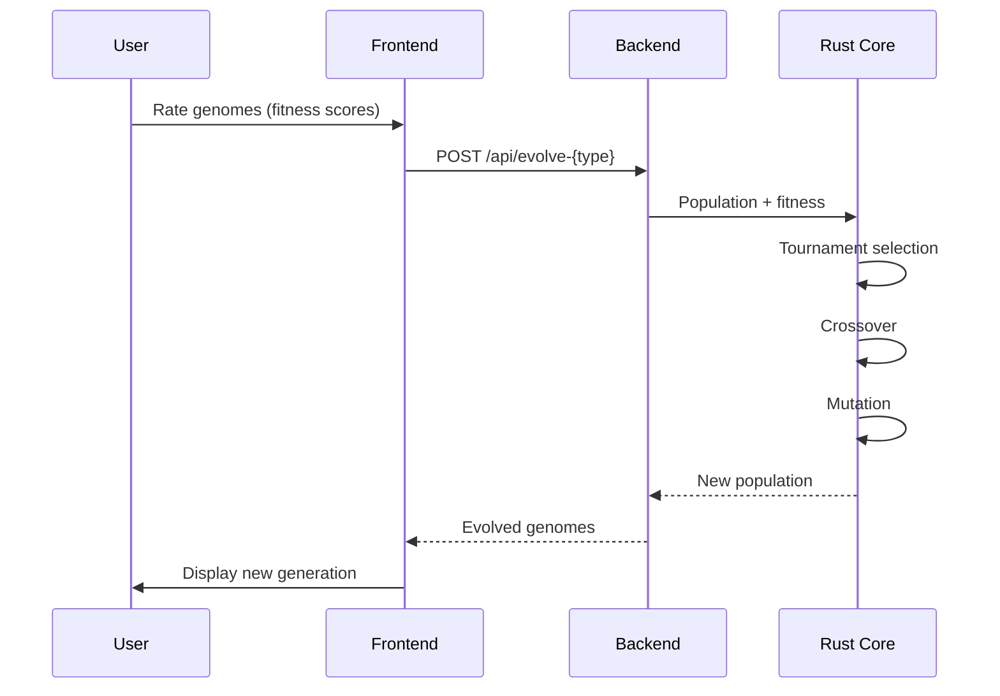
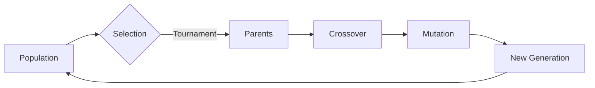
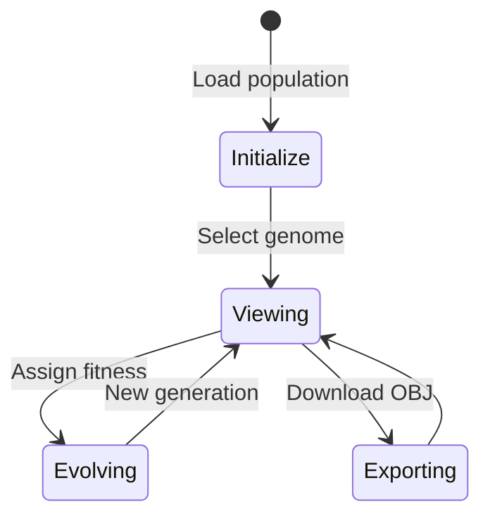
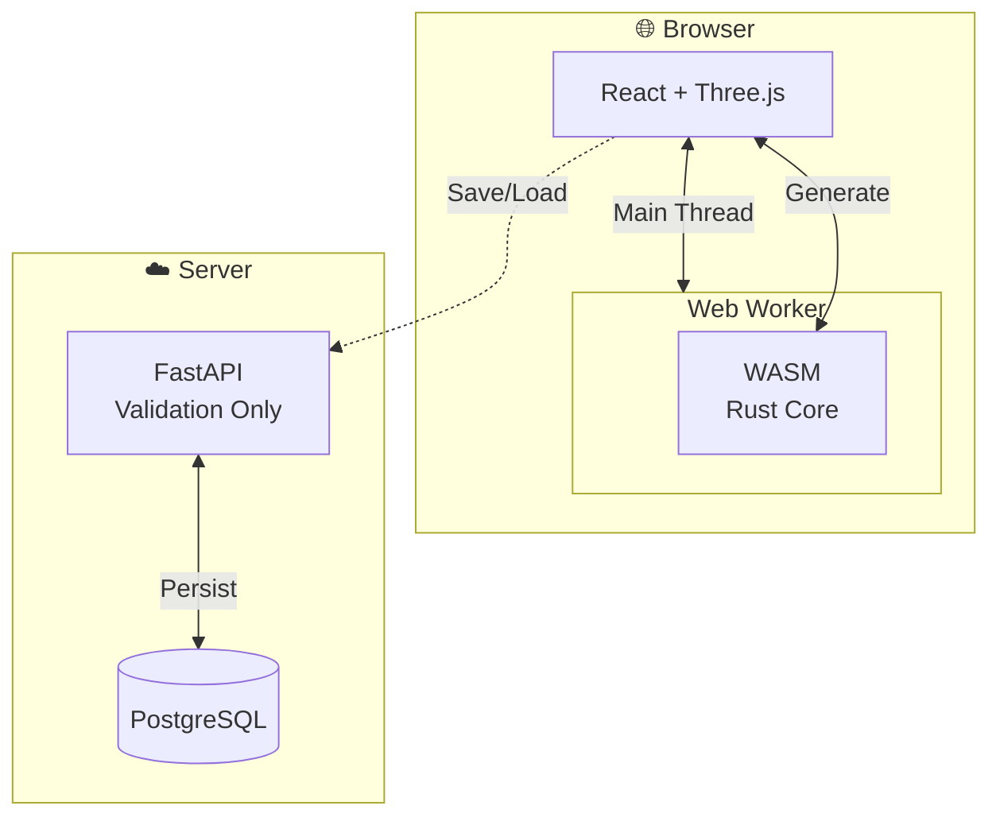

# Architecture

System architecture and component design.

## Overview

ProceduralGraph AI uses a three-tier architecture:



## Data Flow

### Galaxy Generation Flow



### Evolution Flow



## Rust Core

### Module Structure

```rust
// Genome Types
struct Genome { /* terrain parameters */ }
struct PlanetGenome { /* planet parameters */ }
struct GalaxyGenome { /* galaxy parameters */ }

// Generation Functions
fn generate_texture() -> Texture
fn generate_mesh() -> Mesh
fn generate_sphere_mesh() -> Mesh
fn generate_galaxy_points() -> GalaxyPoints

// Evolution Functions
fn evolve_population() -> Vec<Genome>
fn evolve_galaxy_population() -> Vec<GalaxyGenome>
fn evolve_planet_population() -> Vec<PlanetGenome>
```

### Key Algorithms

#### Galaxy Generation

1. **Spiral Distribution**: Logarithmic spiral formula
   ```
   r = distance_ratio * max_radius
   θ = (r * arm_tightness) + (arm_index * 2π/arm_count)
   ```

2. **Perlin Noise Perturbation**: Adds irregularities to arm positions

3. **Stellar Temperature → Color**: Based on black-body radiation physics

#### Genetic Algorithm



**Selection**: Tournament (pick 3 random, take best)

**Crossover**: Uniform (50% chance per gene from either parent)

**Mutation**: Gaussian noise with clamping

## Frontend

### Component Hierarchy

```
App.tsx
├── GalaxyApp.tsx (galaxy-specific UI)
│   └── Scene.tsx (Three.js rendering)
└── App.tsx (main terrain UI)
    └── Scene.tsx
```

### State Flow



## PyO3 Integration

Rust types exposed to Python:

```rust
#[pymodule]
fn procedural_graph_core(m: &Bound<'_, PyModule>) -> PyResult<()> {
    m.add_class::<Genome>()?;
    m.add_class::<GalaxyGenome>()?;
    m.add_class::<PlanetGenome>()?;
    m.add_class::<Texture>()?;
    m.add_class::<Mesh>()?;
    m.add_class::<GalaxyPoints>()?;
    m.add_function(wrap_pyfunction!(generate_texture, m)?)?;
    m.add_function(wrap_pyfunction!(generate_mesh, m)?)?;
    m.add_function(wrap_pyfunction!(evolve_population, m)?)?;
    // ... more functions
    Ok(())
}
```

## Performance Considerations

- **Rust Core**: Memory-safe, zero-cost abstractions
- **Perlin Noise**: O(n) complexity for n octaves
- **Galaxy Generation**: O(star_count) - optimized with Vec::with_capacity()
- **Evolution**: O(population_size × tournament_size)

## Future Architecture (Q3 2025)



Client-side generation via WebAssembly will eliminate server compute costs.
